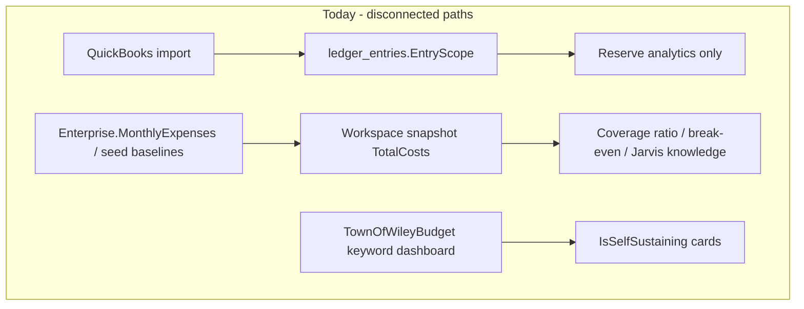

# Enterprise cost reliability and UI layout direction

**Status:** Planned (data track priority, UI follow-up)  
**Created:** June 2026  
**Related:** [wileyco-ui-rebuild-plan.md](wileyco-ui-rebuild-plan.md), [import-data-canonical-inventory.md](import-data-canonical-inventory.md)

## Implementation checklist

| ID                      | Task                                                                                                                                 | Status  |
| ----------------------- | ------------------------------------------------------------------------------------------------------------------------------------ | ------- |
| ledger-cost-service     | Add `EnterpriseLedgerCostService` with FY + EntryScope rollup rules and docs for expense vs revenue treatment                        | pending |
| rollup-on-import        | Hook rollup into `QuickBooksImportService.CommitAsync` and reference-data ledger import; update `Enterprise.MonthlyExpenses`         | pending |
| snapshot-ledger-primary | `WorkspaceSnapshotComposer`: prefer ledger rollup for TotalCosts; add CostSource metadata; fix quadrant costs                        | pending |
| routing-defaults        | Extend `QuickBooksRoutingService` DefaultEnterpriseMappings for Trash/Apartments; align import file overrides                        | pending |
| scoped-analytics        | Enterprise-scoped budget variances/overview in `WorkspaceKnowledgeService`; fix knowledge ProjectedVolume validation                 | pending |
| scoped-budget-refresh   | Filter `RefreshBudgetActualsFromImportedLedgersAsync` by EntryScope/enterprise                                                       | pending |
| integration-tests       | Extend `WorkspaceReferenceDataApiTests` and `QuickBooksImportApiTests` for ledger-primary costs and knowledge scoping                | pending |
| ui-follow-up            | (Follow-up PR) Shell compaction, default collapsed rails, panel KPI band + 2-column workbench template, enterprise comparison matrix | pending |

## Current state (why numbers feel unreliable)

Your mission already states QuickBooks should be the canonical source for actuals ([wileyco-ui-rebuild-plan.md](wileyco-ui-rebuild-plan.md)), but the **live break-even path does not use ledger data**:



| Surface                         | "Paying its own way" formula           | Cost source                                                     |
| ------------------------------- | -------------------------------------- | --------------------------------------------------------------- |
| Workspace / Break-even / Jarvis | `CurrentRate × volume` vs `TotalCosts` | `Enterprise.MonthlyExpenses` or saved snapshot — **not ledger** |
| Data dashboard enterprise cards | YTD Revenue − YTD Expenses             | Budget spreadsheet keywords — **separate path**                 |
| QuickBooks import               | `EntryScope` per row                   | **Never rolls up** into `MonthlyExpenses`                       |

After your `Import Data` seed, ledger rows exist (575) but break-even still used seeded baselines until manually aligned. That matches the architecture gap, not bad seed data.

**Additional reliability gaps to close in the data slice:**

- Default QB routing maps only WSD/Water file patterns; **Trash / Apartments** fall through to Water Utility (`QuickBooksRoutingService.cs` `DefaultEnterpriseMappings`).
- Budget actual refresh aggregates ledger **across all enterprises** by account code (`WorkspaceReferenceDataImportService.cs` `RefreshBudgetActualsFromImportedLedgersAsync`).
- Jarvis knowledge uses **FY-global** variances and budget overview (`WorkspaceKnowledgeService.cs`).
- `POST /api/workspace/knowledge` can 500 when `ProjectedVolume` is 0 (missing validation in `Program.cs` `TryValidateWorkspaceKnowledgeRequest`).

---

## Track 1 (priority): Ledger-primary enterprise costs

**Goal:** Each canonical enterprise's `TotalCosts` / `MonthlyExpenses` reflects **rolled-up QuickBooks ledger actuals** for the selected fiscal year, so break-even, coverage ratio, quadrants, and Jarvis all answer "is this enterprise paying its own way?" from the same numbers clerks import.

### 1. Define rollup rules (document + code)

Add a small domain service, e.g. `EnterpriseLedgerCostService` in `src/WileyWidget.Services/`:

- Input: `enterpriseName`, `fiscalYear`
- Query `ledger_entries` where `EntryScope` matches canonical name (use `WorkspaceEnterpriseCatalog` aliases).
- Aggregate **operating expenses** for the FY (date filter on ledger date fields used by QB import).
- Business rules to codify with council/clerk sign-off (capture in `docs/import-data-schema-template.md` or a short `docs/enterprise-ledger-cost-rollup.md`):
  - Which entry types count as expense vs revenue (e.g. exclude deposits/credits from cost numerator).
  - Whether costs are **monthly** or **annual** totals (today `MonthlyExpenses` drives monthly KPIs but seed values look annual — normalize explicitly).
  - Handling allocation-profile splits already stored per row.

### 2. Roll up after every ledger mutation

Invoke rollup + `Enterprise` update from:

- `QuickBooksImportService.CommitAsync` (clerk panel commits)
- `WorkspaceReferenceDataImportService` sample ledger import path
- Optional: `POST /api/workspace/reference-data/import` completion and QB reroute endpoint

Update `Enterprise.MonthlyExpenses` (and `ModifiedDate` / audit fields) per enterprise; log counts and totals for ops visibility.

### 3. Make snapshot composition ledger-primary

In `WorkspaceSnapshotComposer.cs` `ResolveTotalCosts`:

- Prefer ledger rollup for selected enterprise + FY when ledger data exists.
- Fall back to persisted snapshot → `MonthlyExpenses` only when no ledger rows (degraded/local empty DB).
- Expose metadata on snapshot (e.g. `CostSource: ledger | baseline | snapshot`) so UI can show "costs from QuickBooks actuals" vs fallback.

Apply same source for **four-enterprise hero quadrants** (`BuildBreakEvenQuadrants`) so cross-enterprise comparison is ledger-consistent.

### 4. Fix routing defaults for Trash and Apartments

Extend `DefaultEnterpriseMappings` in `QuickBooksRoutingService.cs`:

- `trash` → `Trash`
- `apartment` → `Apartments`

Align file-name resolution in `WorkspaceReferenceDataImportService.Overrides.cs` with [import-data-canonical-inventory.md](import-data-canonical-inventory.md) (`*-util.xlsx`, `*-wsd.xlsx`, etc.).

### 5. Enterprise-scoped analytics for Jarvis

In `WorkspaceKnowledgeService.cs` and `BudgetAnalyticsRepository.cs`:

- Filter top variances and budget overview by **selected enterprise** (map enterprise → budget account/fund keywords using same catalog as `DashboardService` or ledger `EntryScope`).
- Add `400 Bad Request` for `ProjectedVolume <= 0` in `TryValidateWorkspaceKnowledgeRequest` (mirror baseline rules at line 50 of `Program.cs`).

### 6. Enterprise-scoped budget actual refresh

Change `LoadImportedLedgerRowsAsync` / `BuildActualsByNormalizedCode` to filter by `EntryScope` (or enterprise-specific account mapping) so multi-enterprise GL files do not blend actuals.

### 7. Tests (HighRisk where applicable)

Extend existing integration coverage:

- `WorkspaceReferenceDataApiTests.cs` — after import, `MonthlyExpenses` matches ledger rollup; knowledge returns enterprise-scoped variances.
- `QuickBooksImportApiTests.cs` — commit updates enterprise costs.
- New unit tests for `EnterpriseLedgerCostService` with signed amount fixtures.
- Fix/regression for knowledge validation when volume is 0.

### 8. Local ops helper (optional, small)

Add `Scripts/seed-local-import-data.sh` wrapping `POST /api/workspace/reference-data/import` (you already proved this path with `Import Data/`). Not required for production; reduces repeat setup after DB reset.

---

## Track 2 (follow-up): UI layout — industry patterns and repo gaps

You are correct: the shell stacks content vertically and reserves little horizontal space for charts/grids.

### Current layout constraints

From `WileyWorkspace.razor` and `MainLayout.razor`:

```text
[App nav 19rem] + [Context rail ~280px] + [Main min 420px] + [Jarvis ~340px optional]
+ hero + document center BEFORE splitter (eats ~20rem vertical budget)
```

On a ~1280px laptop with all rails open, the main pane is often **~600px wide** — panels that use `flex-col` + `md:grid-cols-2` only get side-by-side charts at `xl`, so most views feel like a vertical scroll.

### Financial / municipal software patterns to adopt

Patterns common in fund accounting and utility rate tools (Tyler Munis, OpenGov, ClearGov, Envisio-style dashboards):

| Pattern                                 | Purpose                                                       | Wiley Widget application                                                                                               |
| --------------------------------------- | ------------------------------------------------------------- | ---------------------------------------------------------------------------------------------------------------------- |
| **Persistent entity + FY context bar**  | One horizontal strip: fund/enterprise, period, data freshness | Collapse hero KPIs into a slim context bar; move four-enterprise comparison to Data Dashboard                          |
| **KPI band (horizontal)**               | Revenue, expenses, net, coverage, rate gap in one row         | Break-even + dashboard panels: single `grid-cols-4` band, not stacked cards                                            |
| **Chart + table split (60/40)**         | Scan trend left, drill detail right                           | Rates, debt coverage, capital gap, trends: `lg:grid-cols-[1.2fr_0.8fr]` default, not `flex-col`                        |
| **Full-width grid below charts**        | Grids need width for columns                                  | Customer viewer, scenario planner, QB preview: dedicated full-width pane, collapse side rails by default               |
| **Tabbed workspace vs triple splitter** | Reduce horizontal competition                                 | Replace context rail + Jarvis splitter with: left nav tabs OR top tabs + optional right drawer for Jarvis              |
| **Enterprise comparison view**          | Cross-subsidy visibility                                      | Dedicated "Enterprise comparison" panel: 4-column matrix (revenue, cost, net, coverage) — ledger-sourced after Track 1 |
| **Data lineage badge**                  | Trust                                                         | Show `CostSource: QuickBooks FY2026` on KPI strip (from snapshot metadata)                                             |

### Recommended UI slice (after data track)

1. **Shell compaction** — Move document center into a dropdown/menu; shrink hero to context bar; default **collapse** context rail and Jarvis (`WorkspaceLayoutContext.cs`).
2. **Panel layout template** — Standardize panels on: KPI band → 2-column workbench → full-width grid (`Components/Panels/`).
3. **Data Dashboard as executive home** — Ledger-driven enterprise comparison matrix (depends on Track 1).
4. **Wire mobile stack** — `wiley-workspace-stack` CSS exists but `WileyWorkspace.razor` always uses `SfSplitter`; connect breakpoint logic for tablet/mobile.

Update [wileyco-ui-rebuild-plan.md](wileyco-ui-rebuild-plan.md) with layout principles; avoid drive-by Syncfusion upgrades.

---

## Suggested PR sequence (data-first, per AGENTS.md)

| PR       | Scope                                                                       | Risk                         |
| -------- | --------------------------------------------------------------------------- | ---------------------------- |
| **PR-A** | `EnterpriseLedgerCostService` + rollup on QB commit + snapshot `CostSource` | High — rate math             |
| **PR-B** | Routing defaults (Trash/Apartments) + enterprise-scoped budget refresh      | Medium                       |
| **PR-C** | Knowledge variances scoped + knowledge validation fix                       | Medium                       |
| **PR-D** | UI shell compaction + panel workbench template                              | UI — separate from rate math |

---

## Success criteria (data track)

After PR-A–C on a DB seeded from `Import Data/`:

- `GET /api/workspace/snapshot?enterprise=Water Utility&fiscalYear=2026` → `TotalCosts` matches ledger rollup; metadata shows ledger source.
- Four hero quadrants differ per enterprise based on ledger, not identical seeds.
- `POST /api/workspace/knowledge` → 200 with enterprise-specific variances; 400 when volume invalid.
- QuickBooks commit for a util GL file updates **Water Utility** costs without manual baseline edit.
- Trash/Apartments files route to correct `EntryScope` by default.

---

## Out of scope for this plan

- Replacing Blazor WASM with a server-hosted dashboard (architecture stays).
- Auto-importing `Import Data/` in production containers (explicit path / clerk panel remains canonical for monthly ops).
- Profit-margin multipliers via `DepartmentGoal` (break-even stays canonical per `EnterpriseRateService`; margin can be a later enhancement).
